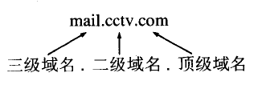
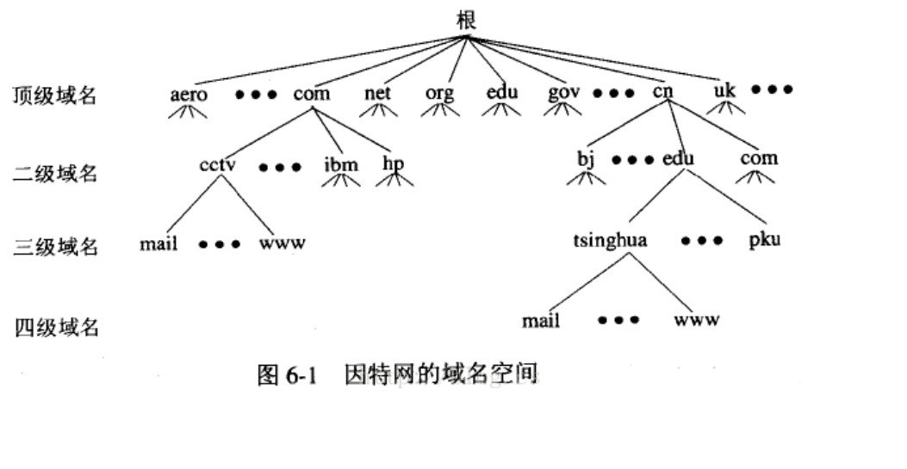

**DNS**（Domain Name System）域名系统
### 一、域名系统
#### 1、域名系统概述
域名系统DNS(Domain Name System)是因特网使用的命名系统，用来把便于人们使用的机器名字转换成为IP地址。域名系统其实就是名字系统。

我们都知道，IP地址是由32位的二进制数字组成的。用户与因特网上某台主机通信时，显然不愿意使用很难记忆的长达32位的二进制主机地址。即使是点分十进制IP地址也并不太容易记忆。相反，大家愿意使用比较容易记忆的主机名字。但是，机器在处理IP数据报时，并不是使用域名而是使用IP地址。这是因为IP地址长度固定，而域名的长度不固定，机器处理起来比较困难。

域名到IP地址的解析是由分布在因特网上的许多域名服务器程序共同完成的。域名服务器程序在专设的结点上运行，而人们也常把运行域名服务器程序的机器称为域名服务器。

#### 2、因特网的域名结构
由于因特网的用户数量较多，所以因特网在命名时采用的是层次树状结构的命名方法。任何一个连接在因特网上的主机或路由器，都有一个唯一的层次结构的名字，即域名(domain name)。这里，“域”(domain)是名字空间中一个可被管理的划分。

如下例子所示：

这是中央电视台用于收发电子邮件的计算机的域名，它由三个标号组成，其中标号com是顶级域名，标号cctv是二级域名，标号mail是三级域名。

DNS既不规定一个域名需要包含多少个下级域名，也不规定每一级域名代表什么意思。各级域名由其上一级的域名管理机构管理，而最高的顶级域名则由ICANN进行管理。用这种方法可使每一个域名在整个互联网范围内是唯一的，并且也容易设计出一种查找域名的机制。

域名只是逻辑概念，并不代表计算机所在的物理地点。据2006年12月统计，现在顶级域名TLD(Top Level Domain)已有265个，分为三大类：
(1)国家顶级域名nTLD：采用ISO3166的规定。如：cn代表中国，us代表美国，uk代表英国，等等。国家域名又常记为ccTLD(cc表示国家代码contry-code)。
(2)通用顶级域名gTLD：最常见的通用顶级域名有7个，即：com(公司企业)，net(网络服务机构)，org(非营利组织)，int(国际组织)，gov(美国的政府部门)，mil(美国的军事部门)。
(3)基础结构域名(infrastructure domain)：这种顶级域名只有一个，即arpa，用于反向域名解析，因此称为反向域名。

