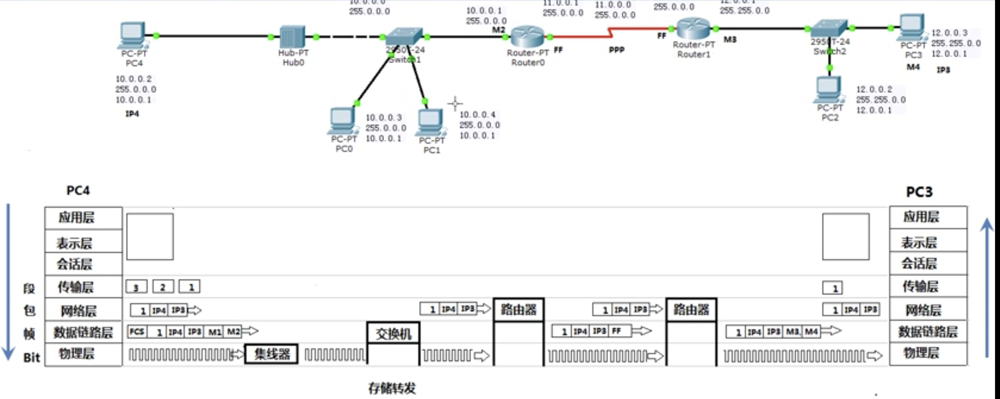

#### 一、相关名词
**OSI**（Open System Interconnection Model开放式系统互联模型）简称为OSI模型,由国际标准化组织提出，一个试图使各种计算机在世界范围内互连为网络的标准框架。定义于ISO/IEC 7498-1

**OSI/RM**（Open Systems Interconnection Reference Model）开放系统互联参考模型

**ISO**（International Organization for Standardization）国际标准化组织

**ARP**（Address Resolution Protocol）地址解析协议，是根据IP地址获取物理地址的一个协议

**TCP/IP**（Transmission Control Protocol/Internet Protocol，传输控制协议/网际协议）是指能够在多个不同网络间实现信息传输的协议簇。TCP/IP协议不仅仅指的是TCP 和IP两个协议，而是指一个由FTP、SMTP、TCP、UDP、IP等协议构成的协议簇， 只是因为在TCP/IP协议中TCP协议和IP协议最具代表性，所以被称为TCP/IP协议。

#### 二、七层模型
#### 第7层 应用层
应用层与提供给用户的网络服务相关，这些服务非常丰富，包括文件传送、电子邮件、P2P应用等。应用层为用户提供了一个使用网络应用的“接口”。

#### 第6层 表示层
表现层主要用于处理应用实体间的交换数据的语法，其目的是解决格式和数据表示的差别，从而为应用层提供一个一致的数据格式，使字符、格式等有差异的设备之间相互通信。除此之外，表现层还可以实现文本压缩、数据加密/解密、字符编码的转换等功能。这一层的功能在某些实际数据通信网络中是有应用层来实现的，而且表示层不独立存在。

#### 第5层 会话层
会话层是指用户与用户的连接，通过在两台计算机间建立、管理和终止通信来完成对话。会话层的主要功能：在建立会话时核实双方身份是否有权参加会话；确定双方支付通信费用；双方在各种选择功能方面（如全双工还是半双工通信）取得一致，在会话建立以后，需要对进程间的对话进行管理与控制，例如，对话过程中某个环节输了故障，会话层在可能条件下必须对这个对话的数据，使数据不丢失，如不能保留，那么终止这个对话，并重新开始。在实际的网络中，会话层的功能已经被应用层所覆盖，很少单独存在。

#### 第4层 传输层
传输层是第一个端到端的层次，也是进程到进程的层次。数据的通信表面上看是在两个主机之间进行，但实质上是发生在两个主机的进程之间。OSI参考模型的前三层可组成公共网络，被很多设备共享，并且计算机——交换结点（典型的交换结点是路由器，交换机等）、交换结点——交换结点是按照“接力”方式传送的。为了防止传送途中报文的丢失，两个主机的进程之间需要实现端到端控制。因此，传输层的功能主要包括复用/分解（区分发送和接收主机上的进程）、端到端的可靠传输、连接控制、流量控制和拥塞控制机制等。

#### 第3层 网络层
网络层解决的核心问题是如何将分组通过交换网络传送至目的主机，因此，网络层的主要功能是数据转发与路由，在交换网络中，信息从源节点出发，要经过若干个中继节点所谓存储转发后，才能到达目的结点。这样一个包括源结点、中继结点、目的结点的集合称为从源结点到目的结点的路径。一般在两个结点之间会有多条路径选择，这种路由选择是网络层要完成的主要功能之一。当网络设备，比如路由器，从一个接口收到数据分组时，需要根据已掌握的路由信息将其转发到合适的接口并向下一个结点发送，直至送达目的结点。此外网络层还要对进入交换网络的通信量加以控制，以避免通信量过大造成交换网络性能下降。

#### 第2层 数据链路层
数据链路层的主要功能是实现在相邻结点之间数据可靠而有效的传输，数据在物理介质内传输过程，不能保证没有任何错误发生。为了能实现有效的差错控制，就采用了一种以“帧”为单位的数据块传输方式。要采用帧格式传输，就必须有相应的帧同步技术，这就是数据链路层的“成帧”（“帧同步”）功能，包括定义帧的格式、类型、成帧的方法等。有了“帧”的存在，就可以将差错控制技术应用在数据帧中，例如，将数据码后面附加一定位数的循环码，从而实现数据链路层的差错控制功能。数据链路层还可以实现相邻结点间通信的流量控制。

#### 第1层 物理层
物理层的主要功能是在传输介质上实现无结构比特流传输。所谓无结构比特流是指不关心比特流实际代表的信息内容，只关心如何将0、1这些比特以合适的信号传送至目的地，因此，物理层要实现信号编码功能，物理层的另一项主要任务就是规定数据终端设备（DTE）与数据通信设备（DCE）之间接口的相关特性，主要包括机械，电气，功能和规程4个方面的特性。机械特性也叫物理特性，说明硬件连接接口的机械特点，如接口的形状、尺寸、插脚的数量和排列方式等；电气特性规定了在物理连接上，导线的电气连接及有关电路的特性，如信号电平大小、接收器和发送器电路特性的说明，信号的识别、最大传输速率的说明等；功能特性说明物理接口各条信号线的用途，如接口信号线的功能分类等；规程特性指明利用接口传输比特流的全过程及各项用于传输的事件发生的合法顺序，包括事件的执行顺序和数据传输的方式，即在物理连接建立、维持和交换信息时，收发双方在各自电路上的动作序列。

#### 三、OSI七层参考模型与TCP/IP协议
<html> <table><tbody><tr><td style="vertical-align:bottom;"> 
OSI七层网络模型
 </td> <td style="vertical-align:bottom;"> 
TCP/IP四层模型
 </td> <td style="vertical-align:bottom;"> 
TCP/IP五层模型
 </td> <td style="vertical-align:bottom;"> 
对应网络协议
 </td> </tr><tr><td style="vertical-align:bottom;"> 
应用层（Application）
 </td> <td rowspan="3"> 
应用层
 </td> <td rowspan="3"> 
应用层
 </td> <td style="vertical-align:bottom;"> 
HTTP、TFTP,&nbsp;FTP, NFS, WAIS、SMTP
 </td> </tr><tr><td style="vertical-align:bottom;"> 
表示层（Presentation）
 </td> <td style="vertical-align:bottom;"> 
Telnet, Rlogin, SNMP, Gopher
 </td> </tr><tr><td style="vertical-align:bottom;"> 
会话层（Session）
 </td> <td style="vertical-align:bottom;"> 
SMTP, DNS
 </td> </tr><tr><td style="vertical-align:bottom;"> 
传输层（Transport）
 </td> <td> 
传输层
 </td> <td> 
传输层
 </td> <td style="vertical-align:bottom;"> 
TCP, UDP
 </td> </tr><tr><td style="vertical-align:bottom;"> 
网络层（Network）
 </td> <td> 
网络互联层
 </td> <td> 
网络层
 </td> <td style="vertical-align:bottom;"> 
IP, ICMP, ARP, RARP, AKP, UUCP
 </td> </tr><tr><td style="vertical-align:bottom;"> 
数据链路层（Data Link）
 </td> <td rowspan="2"> 
网络接口层
 </td> <td> 
数据链路层
 </td> <td style="vertical-align:bottom;"> 
FDDI, Ethernet, Arpanet, PDN, SLIP, PPP
 </td> </tr><tr><td style="vertical-align:bottom;"> 
物理层（Physical）
 </td> <td> 
物理层
 </td> <td style="vertical-align:bottom;"> 
IEEE 802.1A, IEEE 802.2到IEEE 802.11
 </td> </tr></tbody></table> </html>

#### 四、流程图
