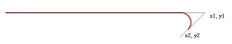
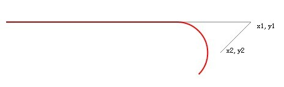
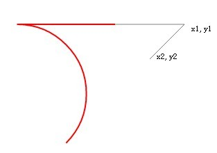
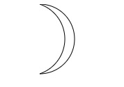
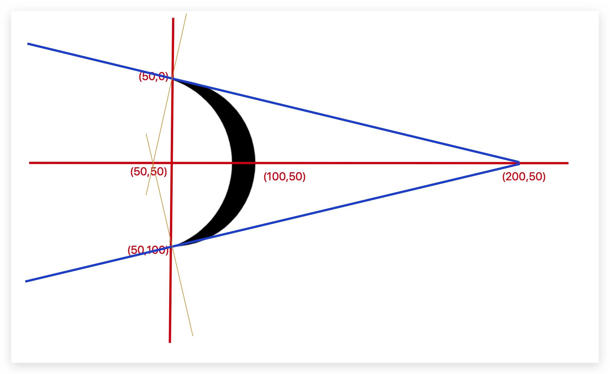

### arcTo
##### 用法：
ctx.arcTo(x1,y1,x2,y2,radius)
##### 参数解析：
（1）(x1,y1)：必需，规定第一个控制点的坐标。
（2）(x2,y2)：必需，规定第二个控制点的坐标。
（3）radius：必需，规定圆弧所在圆的半径尺寸。
##### 详细分析如下：
（1）起点与第一个控制点连接成一条直线。
（2）第一个控制点与第二个控制点连接成一条直线。
（3）那么通过这两条直线与圆的半径可以绘制一个与直线相切的圆弧。
（4）起点与圆弧连接起来，就是最终绘制的图案。
##### 绘制示意图：

```js
var x0=100,
y0=400,
x1 = 500,
y1 = 400,
x2 = 450,
y2 = 450;
radius = 20;
ctx.moveTo(x0,y0);
ctx.arcTo(x1,y1,x2,y2,radius);
```
（1）radius=20

（2）radius=50

（3）var x0=400;  radius=100


##### 画一个月亮
```js
ctx.save()
ctx.strokeStyle = '078'
ctx.beginPath();     
ctx.arc(50,50,50,0.5*Math.PI,1.5*Math.PI,true);
ctx.arcTo(200, 50, 50, 100, 50*dis(50,0,200,50)/150);
ctx.stroke();
ctx.restore()

function dis(x1,y1,x2,y2){
  return Math.sqrt((x2-x1)*(x2-x1)+(y2-y1)*(y2-y1))
}
```


##### 解析：


