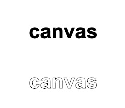
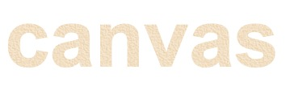
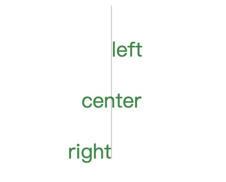
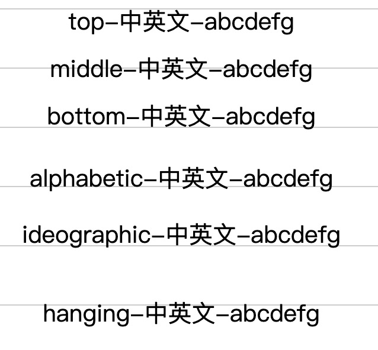

### font
font 属性设置或返回画布上文本内容的当前字体属性，语法与 CSS font 属性相同。

**font**
- 默认值："20px sans-serif"
- ctx.font = font-style font-variant font-weight font-zise font-family


<table>
<tr>
    <td>属性</td>
    <td>值</td>
</tr>
<tr>
    <td>font-style</td>
    <td>
    normal (Default) <br>
    italic (斜体字：通常字体会设计一个专门的斜体字) <br>
    oblique (倾斜字体：简单的将字体倾斜)
    </td>
</tr>
<tr>
    <td>font-variant</td>
    <td>
    normal (Default) <br>
    small-caps (将英文中的小写字母变成小型的大写字母) <br>
    </td>
</tr>
<tr>
    <td>font-weight</td>
    <td>
    lighter <br>
    normal (Default) <br>
    bold<br>
    bolder<br>
    W3C将font-weight分为不同的等级：<br>
    100,200,300,400(normal),<br>
    500,600,700(bold),<br>
    800,900
    </td>
</tr>
<tr>
    <td>font-size</td>
    <td>
    20px (Default) <br>
    2em<br>
    150%<br>
    font-size可以分为以下几种几号：<br>
    xx-small<br>
    x-small<br>
    medium<br>
    large<br>
    x-large<br>
    xx-large<br>
    </td>
</tr>
<tr>
    <td>font-family</td>
    <td>
    web安全字体
    </td>
</tr>
</table>

**fillText**
| 参数 | 描述 |
|--|--|--|
| text | 规定在画布上输出的文本。 |
| x | 开始绘制文本的 x 坐标位置（相对于画布）。 |
| y | 开始绘制文本的 y 坐标位置（相对于画布）。 |
| maxWidth | 可选。允许的最大文本宽度，以像素计。 |

**基本使用**：
```js
ctx.font = 'bold 40px Arial'
ctx.fillText('Canvas', 0, 200)
ctx.strokeText('Canvas', 0, 300)
```


```js
// 渐变
const linearGrad = ctx.createLinearGradient(0,0,800,0)
linearGrad.addColorStop(0.0,'red')
linearGrad.addColorStop(0.25,'orange')
linearGrad.addColorStop(0.5,'yellow')
linearGrad.addColorStop(0.75,'green')
linearGrad.addColorStop(1.0,'purple')
ctx.fillStyle = linearGrad
ctx.fillText('canvascanvascanvascanvascanvascanvascanvascanvascanvas', 0, 400)
```


```js
// 纹理
const backgroundImg = new Image()
backgroundImg.src = 'https://www.cnblogs.com/skins/coffee/images/bg_body.gif'
backgroundImg.onload = () => {
  const pattern = ctx.createPattern(backgroundImg, 'repeat')
  ctx.fillStyle = pattern
  ctx.font = 'bold 100px Arial'
  ctx.fillText('canvas', 0, 500)
}
```


### textAlign属性：调整文本的水平对齐方式
| 值 | 描述| 
|--|--|
| left| 起始点为左边界|
| center| 起始点为中间位置|
| center| 起始点为右边界|

```js
// textAlign
ctx.font = '40px quick'
ctx.textAlign = 'left'
ctx.fillText('left', 400, 1000)
ctx.textAlign = 'center'
ctx.fillText('center', 400, 1100)
ctx.textAlign = 'right'
ctx.fillText('right', 400, 1200)

ctx.strokeStyle = 'rgba(0,0,0,.4)'
ctx.moveTo(400,900)
ctx.lineTo(400,1200)
ctx.stroke()
```


### textBaseline属性：调整文本的垂直对齐方式

| 值 | 描述| 
|--|--|
| top| 起始点为上边界|
| middle| 起始点为中间位置|
| bottom| 起始点为下边界|
| alphabetic(Default)| (拉丁文)|
| ideographic | (汉字，日文等方块文字) |
| hanging | (印度语)|

```js
// textBaseline
ctx.textAlign = 'center'
ctx.font = '40px quick'

ctx.textBaseline = 'top'
ctx.fillText('top-中英文-abcdefg', 400, 1300)

ctx.textBaseline = 'middle'
ctx.fillText('middle-中英文-abcdefg', 400, 1400)

ctx.textBaseline = 'bottom'
ctx.fillText('bottom-中英文-abcdefg', 400, 1500)

ctx.textBaseline = 'alphabetic'
ctx.fillText('alphabetic-中英文-abcdefg', 400, 1600)

ctx.textBaseline = 'ideographic'
ctx.fillText('ideographic-中英文-abcdefg', 400, 1700)

ctx.textBaseline = 'hanging'
ctx.fillText('hanging-中英文-abcdefg', 400, 1800)
```



