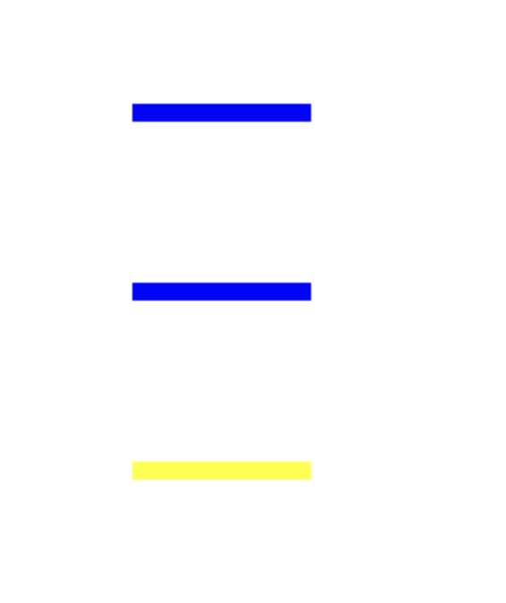
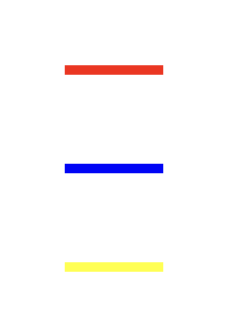
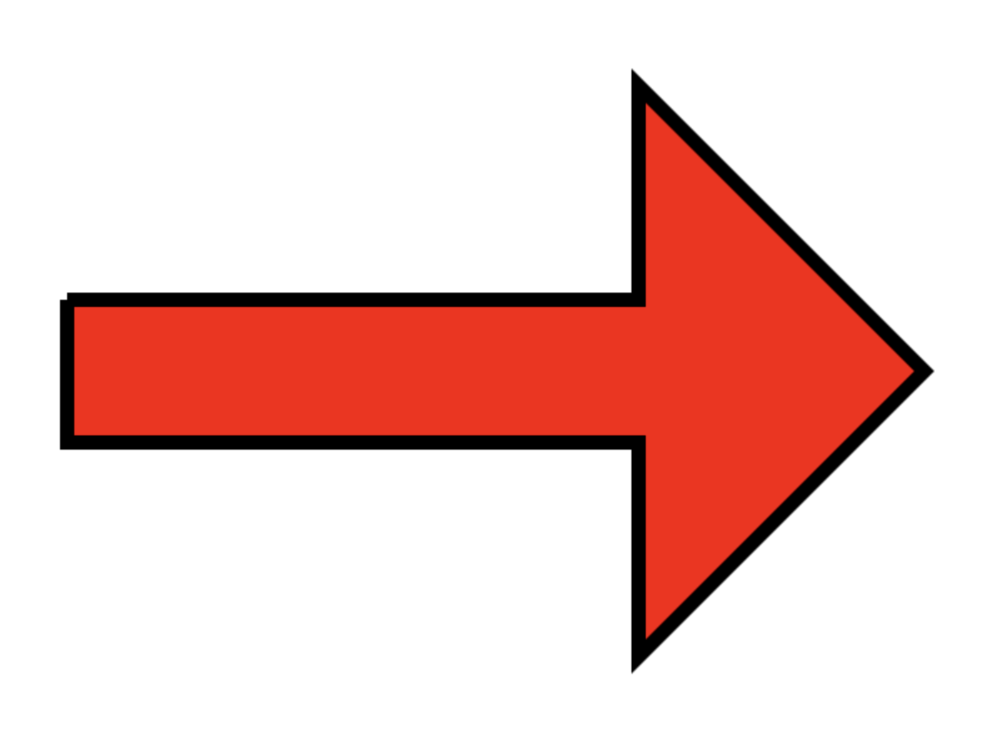
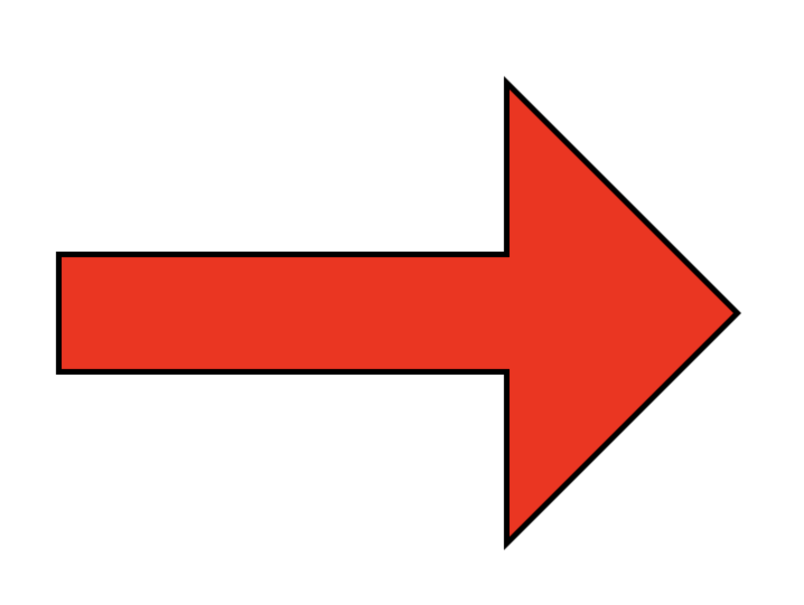
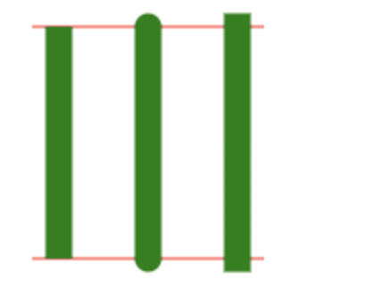
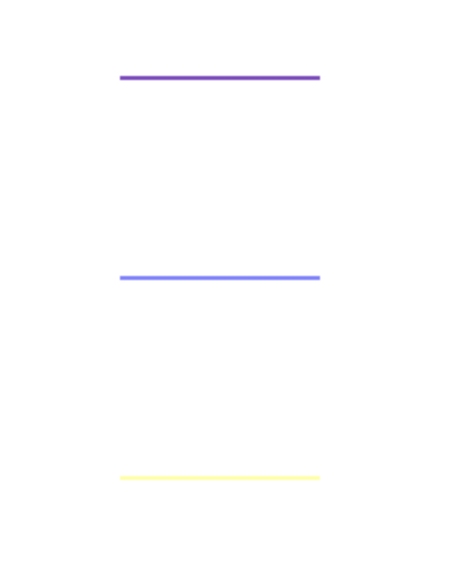
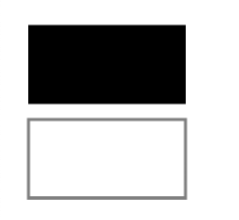
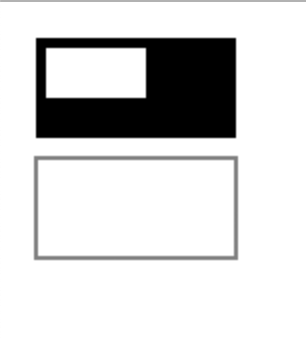

canvas是基于状态绘制的，首先我们来理解一下什么是基于状态，这个词单看比较难理解，这样，我们从另一个角度理解一下，那就是它不是基于对象绘制：就是说我们不会创建一个线条的对象，然后基于这个对象去定义它的各项属性；而是我们对canvas这个画布的整体设置了一些属性，最后来进行绘制
## 路径

1、beginPath() 新建一条路径，路径一旦创建成功，图形绘制命令被指向到路径上生成路径
2、moveTo(x, y) 把画笔移动到指定的坐标(x, y)。相当于设置路径的起始点坐标。
3、closePath() 闭合路径之后，图形绘制命令又重新指向到上下文中
4、stroke() 通过线条来绘制图形轮廓
5、fill() 通过填充路径的内容区域生成实心的图形


### 关于状态绘制意想不到的坑

#### 绘制三条线段

```js
ctx.lineWidth= 10
ctx.beginPath();
ctx.moveTo(100,100);
ctx.lineTo(200,100);
ctx.strokeStyle = "red";
ctx.stroke();

// ctx.beginPath();
ctx.moveTo(100,200);
ctx.lineTo(200,200);
ctx.strokeStyle = "blue";
ctx.stroke();

ctx.beginPath();
ctx.moveTo(100,300);
ctx.lineTo(200,300);
ctx.strokeStyle = "yellow";
ctx.stroke();
```


```js
ctx.beginPath();
ctx.moveTo(100,100);
ctx.lineTo(200,100);
ctx.strokeStyle = "red";
ctx.stroke();

ctx.beginPath();
ctx.moveTo(100,200);
ctx.lineTo(200,200);
ctx.strokeStyle = "blue";
ctx.stroke();

ctx.beginPath();
ctx.moveTo(100,300);
ctx.lineTo(200,300);
ctx.strokeStyle = "yellow";
ctx.stroke();
```


1、第一个beginPath()可以不使用，但是为了代码更规整，加上更好一些
2、beginPath 和 lineTo 一起相当于是moveTo
3、即使写了stroke()，接下来的线条没有写beginPath()，下面的状态也会覆盖上面的状态

#### 绘制一个箭头

```js
ctx.beginPath()
ctx.lineTo(100,350)
ctx.lineTo(500,350)
ctx.lineTo(500,200)
ctx.lineTo(700,400)
ctx.lineTo(500,600)
ctx.lineTo(500,450)
ctx.lineTo(100,450)
ctx.lineTo(100,350)

ctx.fillStyle = 'red'
ctx.lineWidth = 10

ctx.fill()
ctx.stroke()
```



```js
ctx.beginPath()
ctx.lineTo(100,350)
ctx.lineTo(500,350)
ctx.lineTo(500,200)
ctx.lineTo(700,400)
ctx.lineTo(500,600)
ctx.lineTo(500,450)
ctx.lineTo(100,450)
ctx.closePath()

ctx.fillStyle = 'red'
ctx.lineWidth = 10

ctx.stroke()
ctx.fill()
```


1、如果直接通过lineTo()闭合曲线时会有一个缺角，但是通过closePath()闭合可以避免这个问题
2、填充方法fill()写在描边方法stroke()下面时，会覆盖掉一部分描边

#### lineCap

lineCap 属性设置或返回线条末端线帽的样式。

| 属性 | 描述 |
|--|--|
| butt | 默认。向线条的每个末端添加平直的边缘。|
| round | 向线条的每个末端添加圆形线帽。|
| square | 向线条的每个末端添加正方形线帽。|

```js
var lineCap = ['butt','round','square'];
cxt.strokeStyle="red";
cxt.beginPath();
cxt.moveTo(10,10);
cxt.lineTo(140,10);
cxt.moveTo(10,140);
cxt.lineTo(140,140);
cxt.stroke();

cxt.strokeStyle="green";
for (i = 0; i < lineCap.length; i++){
	cxt.lineWidth=15;
	cxt.lineCap=lineCap[i];
	cxt.beginPath();
	cxt.moveTo(25+i*50,10);
	cxt.lineTo(25+i*50,140);
	cxt.stroke();
}
```



#### ？？未解之谜
当我不设置lineWidth或者设置为1的时候，后面的状态没有完全覆盖前面的状态，而是叠加了前面的状态
```js
ctx.beginPath();
ctx.moveTo(100,100);
ctx.lineTo(200,100);
ctx.strokeStyle = "red";
ctx.stroke();

// ctx.beginPath();
ctx.moveTo(100,200);
ctx.lineTo(200,200);
ctx.strokeStyle = "blue";
ctx.stroke();

ctx.beginPath();
ctx.moveTo(100,300);
ctx.lineTo(200,300);
ctx.strokeStyle = "yellow";
ctx.stroke();
```


## 矩形

1、rect(x, y, width, height)：绘制一个矩形。
2、fillRect(x, y, width, height)：绘制一个填充的矩形。
3、strokeRect(x, y, width, height)：绘制一个矩形的边框。
4、clearRect(x, y, widh, height)：清除指定的矩形区域，然后这块区域会变的完全透明。

```js
ctx.fillRect(10, 10, 100, 50);     // 绘制矩形，填充的默认颜色为黑色
ctx.strokeRect(10, 70, 100, 50);   // 绘制矩形边框
```



```js
ctx.fillRect(10, 10, 100, 50);     // 绘制矩形，填充的默认颜色为黑色
ctx.strokeRect(10, 70, 100, 50);   // 绘制矩形边框
ctx.clearRect(15, 15, 50, 25);
```

