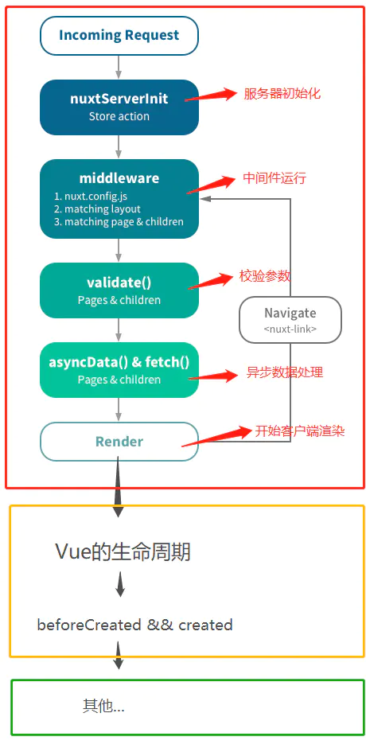
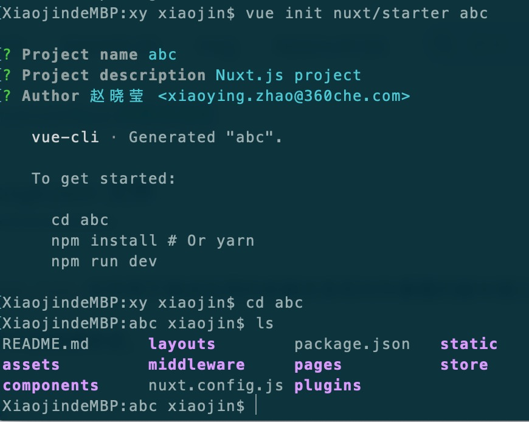
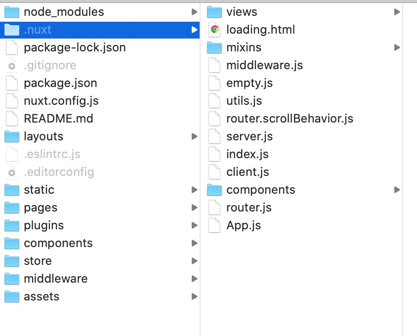
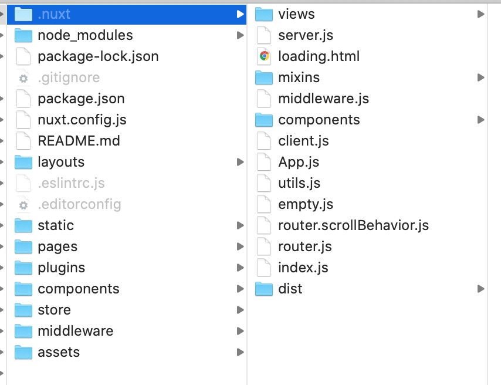

### 一、SSR概念
**SSR** 
server side render 服务端渲染

**客户端渲染**
页面初始加载的 HTML 页面中无网页展示内容，需要加载执行Js代码，通过 js 渲染生成页面。比较代表性的为React,Vue,Angular三大前端框架的SPA(Single Page Application)应用。

**服务端渲染**
用户请求服务器，服务器上直接生成 HTML 内容并返回给浏览器。客户端所需要做的仅仅是html页面的展现和之后的DOM事件处理。代表为传统的JSP,PHP,ASP应用。

**同构** 
同构这个概念存在于 Vue，React 这些新型的前端框架中，同构实际上是客户端渲染和服务器端渲染的一个整合。两端共用一套代码，只是服务端采用nodeJS执行，客户端采用JS执行；在加载首屏的时候，执行服务端代码，页面渲染和请求js同时进行。从首屏进入第二页时就不请求服务端代码了，直接执行Vue的路由跳转。
（这里首屏的概念不是首页，而是用户打开的第一页，例如：A打开司机招聘的首页，点击其中一条详情进入详情页，然后将详情页分享给B，B打开的是详情页。这里A的首屏是首页，B的首屏是详情页）

### 二、使用SSR的利弊
#### SSR的优势
1. 更利于SEO
爬虫只会爬取源码，不会执行网站的任何脚本（Google除外，Google等页面加载完之后再去爬取内容，所以Google的爬虫可以爬取单页面应用）
2. 更利于首屏渲染
首屏的渲染是node发送过来的html字符串，并不依赖于js文件了，这就会使用户更快的看到页面的内容。尤其是针对大型单页应用，打包后文件体积比较大，普通客户端渲染加载所有所需文件时间较长，首页就会有一个很长的白屏等待时间。

#### SSR的局限
1. 服务端压力较大
本来是通过客户端完成渲染，现在统一到服务端node服务去做。尤其是高并发访问的情况，会大量占用服务端CPU资源；
2. 开发条件受限
服务端代与客户端共用一套代码，但是执行周期不一致，写法也有略微不同
3. 学习成本相对较高
还需要掌握node、Koa2等相关技术。相对于客户端渲染，项目构建、部署过程更加复杂。


### 三、介绍NUXT 
 [nuxt官网](https://zh.nuxtjs.org/)
#### nuxt的优点：
 - 基于 Vue.js
 - 自动代码分层
 - 服务端渲染
 - 强大的路由功能，支持异步数据
 - 静态文件服务
 - ES2015+ 语法支持
 - 打包和压缩 JS 和 CSS
 - HTML 头部标签管理
 - 本地开发支持热加载
 - 集成 ESLint
 - 支持各种样式预处理器： SASS、LESS、 Stylus 等等
 - 支持 HTTP/2 推送

#### 流程图
下图阐述了 Nuxt.js 应用一个完整的服务器请求到渲染（或用户通过 `<nuxt-link> `切换路由渲染页面）的流程：

生命周期流程图，红框内的是Nuxt的生命周期(运行在`服务端`)，黄框内`同时运行在服务端&&客户端`上，绿框内则运行在`客户端`
1. 红框、黄框内的周期都不存在Window,document,navigator对象
```js
export default {
  asyncData() {
    console.log(window) // 服务端报错
  },
  fetch() {
    console.log(window) // 服务端报错
  },
  created () {
    console.log(window) // undefined
  },
  mounted () {
    console.log(window) // Window {postMessage: ƒ, blur: ƒ, focus: ƒ, close: ƒ, frames: Window, …}
  }
}
```
但也不是不可以在这些周期使用客户端代码，只需要加一个判断平台的条件即可：
```js
if (process.client){
  // 这里执行服务端不支持的代码
}
```

### 三、开始
1、运行一个NUXT项目
```js
$ npx create-nuxt-app abc
```
我的电脑运行这条命令慢的出奇，所以我用了另一种方式
```js
$ npm install -g @vue/cli-init
// 如果已安装过vue-cli可以不用执行上面这条
$ vue init nuxt/starter abc
```

2、启动项目
```js
$ cd abc
$ npm install
$ npm run dev
// 在浏览器里执行：`http://localhost:3000/`
```
这时项目中会多一个.nuxt的文件



3、打包
```js
npm run build
```
这时看到.nuxt中的文件变了，并且多了一个dist文件夹（这里有一个坑，通常我们的.gitignore文件会忽略dist文件，这里要注意）


4、目录详解
```js
|-- .nuxt                            // Nuxt运行时自动生成，和build之后的代码
|-- assets                           // 资源目录 assets 用于组织未编译的静态资源如 LESS、SASS 或 JavaScript
|-- components                       // 用于自己编写的Vue组件，比如滚动组件，日历组件，分页组件
|-- layouts                          // 布局目录，用于组织应用的布局组件，不可更改。
|-- middleware                       // 用于存放中间件
|-- pages                            // 用于存放写的页面，我们主要的工作区域
|-- plugins                          // 用于存放JavaScript插件的地方
|-- static                           // 用于存放静态资源文件，比如图片
|-- store                            // 用于组织应用的Vuex 状态管理。
|-- .editorconfig                    // 开发工具格式配置
|-- .eslintrc.js                     // ESLint的配置文件，用于检查代码格式
|-- .gitignore                       // 配置git不上传的文件
|-- nuxt.config.js                   // 用于组织Nuxt.js应用的个性化配置，已覆盖默认配置
|-- package-lock.json                // npm自动生成，用于帮助package的统一性设置的，yarn也有相同的操作
|-- package-lock.json                // npm自动生成，用于帮助package的统一性设置的，yarn也有相同的操作
|-- package.json                     // npm包管理配置文件
```