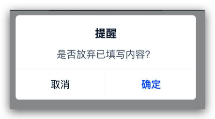

### 使用第三方插件
举例swiper,babel-polyfill和postcss-pxtorem插件
#### swiper
1. 安装插件（略过）
2. 我们需要在程序运行前配置好这个插件
在`plugins`中新建`vue-swiper.js`文件：
```js
import Vue from 'vue'
import VueAwesomeSwiper from 'vue-awesome-swiper/dist/ssr'
 
Vue.use(VueAwesomeSwiper)
```
在nuxt.config.js中配置
```js
plugins: [
  { src: '~/plugins/vue-swiper.js', ssr: false }
]
```
不支持ssr的系统，插件只在浏览器里使用的话，需要加`ssr:false`属性


#### babel-polyfill
1. 安装插件（略过）
2. 我们需要在程序运行前配置好这个插件
在`plugins`中新建`babel-polyfill.js`文件：
```js
import 'babel-polyfill'
```
在nuxt.config.js中配置
```js
plugins: [
  { src: '@/plugins/babel-polyfill', ssr: true },
]
```

#### postcss-pxtorem
1. 安装插件（略过）
2. 在nuxt.config.js中配置
```js
build: {
  extractCSS: true,
  /*
  ** You can extend webpack config here
  */
  postcss: {
    plugins: {
      'postcss-pxtorem': {
        rootValue: 37.5, //默认根目录字体大小(px)
        propList: ['*']
      },

      'autoprefixer': {
        overrideBrowserslist: ['Android >= 4.0', 'iOS >= 7']
      }
    }
  }
}
  ```

### 自己编写插件
#### dialog插件



1. 我们在`components`文件夹下新建一个组件`showDialog.vue`

  ``` js
  <template>
    <div class="dialogWrapper"
        v-if="show"
        @touchmove.prevent>
      <div class="content">
        <h3>{{title}}</h3>
        <p v-html='content'></p>
        <div class="btns"
            v-if="num==2">
          <button class="cancel"
                  @click="cancel();complete();">{{cancelTxt}}</button>
          <button class="sure"
                  @click="sure();complete();">{{sureTxt}}</button>
        </div>
        <div class="btns single"
            v-if="num==1">
          <button class="sure"
                  @click="sure();complete();">{{sureTxt}}</button>
        </div>
      </div>
    </div>
  </template>  
  <script>
  export default {
    name: 'showDialog',
    data () {
      return {
        show: false,
        title: '标题',
        content: '',
        num: 1,
        cancelTxt: '取消',
        sureTxt: '确定'
      }
    },
    methods: {
      cancel () {
        this.show = false
      },
      sure () {
        this.show = false
      },
      complete () {
        this.show = false
      }
    }
  }
  </script>
  <style lang="less" scope>
  .dialogWrapper {
    position: fixed;
    width: 100%;
    height: 100%;
    background: rgba(0, 0, 0, 0.4);
    top: 0;
    left: 0;
    z-index: 10000;
    .content {
      width: 299px;
      border-radius: 6px;
      background: #fff;
      position: absolute;
      overflow: hidden;
      top: 50%;
      left: 0;
      right: 0;
      margin: auto;
      transform: translateY(-50%);
      padding-top: 20px;
      h3 {
        font-size: 18px;
        font-weight: bold;
        text-align: center;
        color: rgba(3, 16, 42, 1);
        line-height: 20px;
      }
      p {
        padding: 14px 35px;
        font-size: 16px;
        text-align: center;
        color: rgba(3, 16, 42, 0.7);
        line-height: 20px;
      }
    }
    .btns {
      width: 100%;
      display: flex;
      background: #fff9fafa;
      padding-top: 2px;
      &.single {
        button {
          margin: 0;
        }
      }
      button {
        flex: 1;
        height: 50px;
        font-size: 16px;
        line-height: 18px;
        text-align: center;
        justify-content: center;
        color: rgba(3, 16, 42, 1);
        background: #fff;
        &:first-child {
          margin-right: 1px;
        }
        &:last-child {
          margin-left: 1px;
        }
        &.sure {
          font-weight: bold;
          color: rgba(0, 87, 255, 1);
        }
      }
    }
  }
  </style>
  ```
2. 在文件夹`plugins`新建js文件`vue-plugins.js`
  ```js
  import Vue from 'vue'
  import showDialog from '~/components/plugins/showDialog.vue'
  export default ({ app }, inject) => {
    if (process.client) {

      const DialogConstructor = Vue.extend(showDialog)

      // 生成一个该子类的实例
      const dialog = new DialogConstructor();

      // 并将此div加入全局挂载点内部
      dialog.$mount(document.createElement('div'))

      document.body.appendChild(dialog.$el)

      inject('showDialog', ({ title, content, num, sureTxt, cancelTxt, cancel, sure }) => {
        dialog.show = true
        title && (dialog.title = title)
        content && (dialog.content = content)
        num && (dialog.num = num)
        sureTxt && (dialog.sureTxt = sureTxt)
        cancelTxt && (dialog.cancelTxt = cancelTxt)
        cancel && (dialog.cancel = cancel)
        sure && (dialog.sure = sure)
      })
    }
  }
  ```
3. 在nuxt.config.js中配置
  ```js

  /*
  ** Plugins to load before mounting the App
  */
  plugins: [
    '~/plugins/vue-plugins.js',
  ]
  ```
4. 使用
  ```js
  created () {
    // 单按钮
    this.$showDialog({
      title: '提交成功',
      content: '我们将尽快处理，如有其它问题请致电：010-56592180',
      sureTxt: '我知道了'
    })

    // 双按钮
    this.$showDialog({
      title: '提醒',
      content: '是否放弃已填写内容？',
      num: 2,
      sure: () => {
        // 确定
      }
    })

    this.$showDialog({
      title: '提醒',
      content: '是否放弃已填写内容？',
      num: 2,
      sureTxt: '好的',
      cancelTxt: '我再想想',
      sure: () => {
        // 确定
      },
      cancel () {
        // 取消
      }
    })
  }
  ```