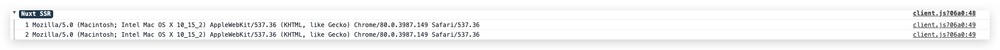

### 路由
nuxt的路由没有router文件，nuxt的路由就是`page`文件夹下的文件目录

以下目录结构
```js
pages/
--| _slug/
-----| comments.vue
-----| index.vue
--| users/
-----| _id.vue
--| index.vue
```
Nuxt.js 生成对应的路由配置表为：
```js
router: {
  routes: [
    {
      name: 'index',
      path: '/',
      component: 'pages/index.vue'
    },
    {
      name: 'users-id',
      path: '/users/:id?',
      component: 'pages/users/_id.vue'
    },
    {
      name: 'slug',
      path: '/:slug',
      component: 'pages/_slug/index.vue'
    },
    {
      name: 'slug-comments',
      path: '/:slug/comments',
      component: 'pages/_slug/comments.vue'
    }
  ]
}
```
看到上面的`_slug`和`_id`了吗，这是nuxt的动态路由，其中`_slug`是目录，`_id`是文件，动态目录下的`index.vue`是默认跳转的路由，这代表：
1. `http://localhost:3000/a`，`http://localhost:3000/b` 打开的文件是 `pages/_slug/index.vue`
2. `http://localhost:3000/a/comments`，`http://localhost:3000/b/comments` 打开的文件是 `pages/_slug/comments.vue`
3. `http://localhost:3000/users/123`，`http://localhost:3000/users/abc` 打开的文件是 `pages/users/_id.vue`

### 动态嵌套路由
nuxt也可以在在动态路由下配置动态子路由。

假设文件结构如下：

```js
pages/
--| _category/
-----| _subCategory/
--------| _id.vue
--------| index.vue
-----| _subCategory.vue
-----| index.vue
--| _category.vue
--| index.vue
```
Nuxt.js 自动生成的路由配置如下：
```js
router: {
  routes: [
    {
      path: '/',
      component: 'pages/index.vue',
      name: 'index'
    },
    {
      path: '/:category',
      component: 'pages/_category.vue',
      children: [
        {
          path: '',
          component: 'pages/_category/index.vue',
          name: 'category'
        },
        {
          path: ':subCategory',
          component: 'pages/_category/_subCategory.vue',
          children: [
            {
              path: '',
              component: 'pages/_category/_subCategory/index.vue',
              name: 'category-subCategory'
            },
            {
              path: ':id',
              component: 'pages/_category/_subCategory/_id.vue',
              name: 'category-subCategory-id'
            }
          ]
        }
      ]
    }
  ]
}
```
这里注意：`_category.vue`与`_category/`同级


### 路由参数校验
在动态路由中可以设置参数校验，例如文章详情页的路由是`http://localhost:3000/article/123456`，`123456`是文章id，文章id永远都是数字，不可能是汉字，所以可以在`pages/article/_id.vue`页面校验一下参数：
```js
export default {
  validate ({ params }) {
    // 必须是number类型
    return /^\d+$/.test(params.id)
  }
}
```
如果校验方法返回的值不为 true或Promise中resolve 解析为false或抛出Error ， Nuxt.js 将自动加载显示 404 错误页面或 500 错误页面。

新建`error.vue`页面在`layouts`文件夹中，在`error.vue`页面中可以捕获到：
```js
<template>
  <div>
    <not-found v-if="error.statusCode==404"></not-found>
    <error-page v-else></error-page>
  </div>
</template>
<script>
import notFound from '~/components/404.vue'
import errorPage from '~/components/500.vue'
export default {
  props: ['error'],
  components: { notFound, errorPage }
}
</script>
```

### 路由中间件
##### 中间件允许您定义一个自定义函数运行在一个页面或一组页面渲染之前。
它可以做到在打开页面或者切换路由之前，加一些判断，例如重定向之类的操作。
中间件放在`middleware`文件夹中，文件名就是中间件的名字(middleware/auth.js将成为 auth 中间件)
中间件的配置方式：
```js
// nuxt.config.js
module.exports = {
  router: {
    middleware: 'stats'
  }
}
```
可以再中间件中加重定向：
```js
export default function ({ isHMR, redirect }) {
  if (isHMR) return

  if (route.fullPath == '/') {
    return redirect('/all')
  }
}
```
还可以加一些其他操作，例如将userAgent赋值给context：
```js
export default function ({ isHMR, app, req, store, route, params, error, redirect }) {
  if (isHMR) return
  context.userAgent = process.server ? context.req.headers['user-agent'] : navigator.userAgent

  if (route.fullPath == '/') {
    return redirect('/all')
  }
}
```
这样的话，在红框，黄框周期内就可以愉快的使用userAgent了:
```js
validate (context) {
  console.log(1, context.userAgent)
  return true
},
asyncData (context) {
  console.log(2, context.userAgent)
}
```
