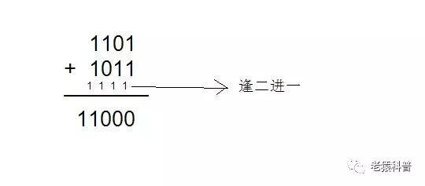
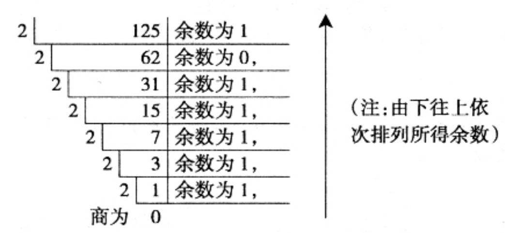

#### 什么是二进制
> 世界上有10种人：一种是懂得二进制的，另一种是不懂二进制的

二进制是计算技术中广泛采用的一种数制。二进制数据是用0和1两个数码来表示的数。它的基数为2，进位规则是“逢二进一”，借位规则是“借一当二”，由18世纪德国数理哲学大师莱布尼兹发现。当前的计算机系统使用的基本上是二进制系统。

十进制0至9的二进制表示：


十进制	二进制	
0	0	
1	1	
2	10	
3	11	
4	100	
5	101
6	110
7	111
8	1000
9	1001


```
加法： 0+0=0；0+1=1；1+0=1；1+1=10

求 1101 + 1011 的和
```


#### 8位二进制数
`256 128 64 32 16 8 4 2 1`
`___  ___  __  __  __ _  _ _  _`

#### 如何得到二进制
e.g. 将125转化成二进制 1111101
可以使用短除法得到125的二进制值



##### 1. 按位或 |
> |与||操作符的道理也是一样的，只要两个数中有一个数为1，结果就为1，其他则为0

##### 1. 按位与 &
> &运算符表示只有两个数的值为1时，才返回1

使用场景：我们管理系统做表单checkbox多选是，加入我们有a、b、c、d四个chebox的选项，1，2，4，8分别代表checkbox的value值，当我们全选a + b + c + d的时候，可以将1 | 2 | 4 | 8 = 15传给java后台，如果只选择a + c的时候，则传递给java后台的值为1 | 4 = 5。
那么我们做编辑功能的时候，如何判断checkbox是否被选中？很简单，用&符号就可以，比如用户选择了a+c,后台给我们返回5，c的值为1，那么 4 & 5 = 4， b的选项我们是没有选择的，则 2 & 5 = 0，也就是说，选中的通过&的运算值为>0的值，没有选中的将会为0。

```js
1 | 2 | 4 | 8 = 15
1 | 4 = 5
4 & 5 = 4
2 & 5 = 0
```

##### 按位异或 ^
> 两个操作数相应的比特位有且只有一个1时，结果为1，否则为0

使用场景：
(1)假如我们通过某个条件来切换一个值为0或者1
```js
//普通的写法
  function update(toggle) {
      var num = toggle ? 1 : 0;
      console.log(num)
  }
  update(true);
  // 通过异或我们可以这么写
  num = num ^ 1;  //num为true的返回 0， 为 false返回1
```
(2)可以在不使用第三变量的值的情况下交换两个变量的值
```js
 let a = 5,
        b = 6;

    a = a ^ b;
    b = a ^ b;
    a = a ^ b;
```