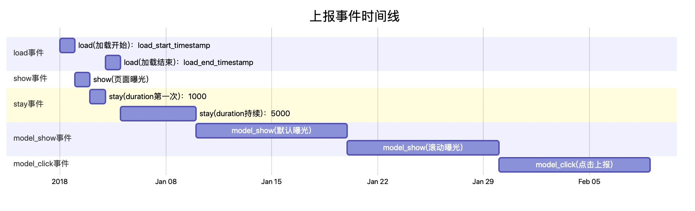

什么东西在我们的生活和工作当中可有可无，但是有了它立马会提升一个档次呀~ ———— 那就是甘特图Gantt chart，就是下面这个东西啦啦啦

```
gantt
dateFormat  YYYY-MM-DD
title 上报事件时间线

section load事件
load(加载开始)：load_start_timestamp          :    p1, 2018-01-01, 1d
load(加载结束)：load_end_timestamp            :    p2, after p4, 1d

section show事件
show(页面曝光)                            :           p3, after p1, 1d

section stay事件
stay(duration第一次)：1000           :            p4, after p3, 1d
stay(duration持续)：5000           :           p5, after p2, 5d

section model_show事件
model_show(默认曝光)          :            p6, after p5, 10d
model_show(滚动曝光)          :            p7, after p6, 10d

section model_click事件
 model_click(点击上报)          :            p8, after p7, 10d

```
当当当当~
